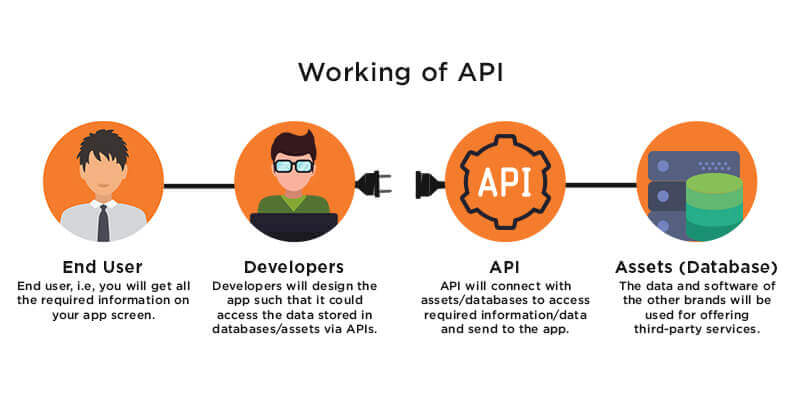

WhatsApp has made everything easy for businesses to expand, reach out and serve many customers as fast as possible. With whatsapp business app and API doing the great job, but i would like one to know the differences between the two. This will help you know how you business can benefit from either.

## Know the difference between WhatsApp Business App and API

WhatsApp is a cross-platform messaging and Voice over IP (VoIP) service owned by Facebook, Inc. It allows users to send text messages and voice messages, make voice and video calls, and share images, documents, user locations, and other media.
WhatsApp is one of the most popular messaging apps in the world. It has over 2 billion active users and is available in 120 different languages.

Its good to point out that whatsapp started with messenger app before the launch of business app. Let start with a recap on the differences between the two, messenger and business app.

## WhatsApp messenger Vs WhatsApp bussiness

### WhatsApp messenger App

With this app you can have personal conversations between friends and family. Besides sending text messages, you can share pictures , documents, start a video call and much more... .
You can also use stickers to spice up your conversations. This is suited for non-business people as it will not provide the user ability to do any automation.

### WhatsApp Business App

WhatsApp Business App is built with focus of small-medium business operation to easy customer communication. The app will help you in growing the business with its rich features such as business profile, product catalog, quick messaging(away messages, greeting messages). This is focused on small to medium businesses.

Business App can do all messenger app can do with added bonus to work in a business manner...
WhatsApp business.
With WhatsApp business, there are two distinct products namely whatsapp business app(discussed above) and WhatsApp business API. Lets dive into business API.

## What is an API?

Let's do a recap of what an API is?
An API(Application Programming Interface) is communication mechanism that allows two software/programs to communicate together under set communication protocols.

The use of WhatsApp business API is to enable advanced automation of business operations such as using A.I power chatbots, customer care services, hence likely preferred for large organizations.

## WhatsApp business app vs WhatsApp business API

Lets see some major diffrences between the two basing on the following criteria

1. Set up

With an App, the set up is fast as you just need to download the app, register your number for whatsapp business and fill some important information about your business where as for API, you will have to apply to WhatsApp cloud or whatsapp business partners to have your business number verified. The process may take some work days though.

2. Cost

WhatsApp Business app is free of usage while Business API needs to be paid for to utilize it fully in production. With an API, business can obtain a verification tick.

This shows your customers that the account is genuine and safe to interact with, resulting in more engagement.(Though the application process takes time).

3. Usage

With the App, WhatsApp targets small to medium businesses that can manage to handle customers with few automation needs. It allows upto 5 connected devices to enable businesses to work with a shared business account.
The API, is mainly focused on large organizations that would like to reply more on advanced automation to serve their huge customers.

This is no limit that only large organizations can use the API, even small and medium businesses can apply for API usage in production to leverage the power of Advanced automation such as A.I powered chatbots like those built using sarufi.

4. Number of device connection

An app allows connection of up to 5 devices to allow business operators to chat individually with customers. With it can be used on multiple devices with custom interfaces. With an APP, you can make calls where as an API protocol does not allow making calls.

5. Messaging

WhatsApp business App allows the business to send unlimited messages and of any content any any time.
For WhatsApp Business API conversations fall into two categories that are priced differently with all having a 24 hours reply window.

- User-initiated

    A conversation that initiates in response to a user message. Whenever a business replies to a user within the 24 hour [customer service window](https://developers.facebook.com/docs/whatsapp/overview/messages), that message will be associated with a user-initiated conversation. Businesses can send free-form messages within this 24 hour customer service window. With user initiated conversation, the business can reply without message limits and no content limit(you can use medias here such as images, videos, files,...)

- Business-initiated

    A conversation that initiates a business initiates by sending a user a message outside a 24 hour customer service window. These messages use [message templates](https://developers.facebook.com/docs/whatsapp/api/messages/message-templates) which have limited contents that can be used, also templates are to be verified by whatsapp before getting into usage.

6. Number of broadcasts

WhatsApp business App limits broadcasts to 256 contacts while an API can allow more broadcasts making it of many advantages to the businesses.

7. WhatsApp Automation

On automation side, an app provides few automation techniques such as qiuck replies, greeting messages and away messages.
Using API, a business will have ability to do more advanced automations mostly important using A.I powered chatbots. You can build chatbot using sarufi.
With whatsapp business app, you can not integrate it with a chatbot. You will need to use API to do this integration.

## Final word

When we talk about whatsapp integration of chatbots, we generally mean using whatsapp cloud api. By using Sarufi your business can build a production WhatsApp integration-ready chatbot.
